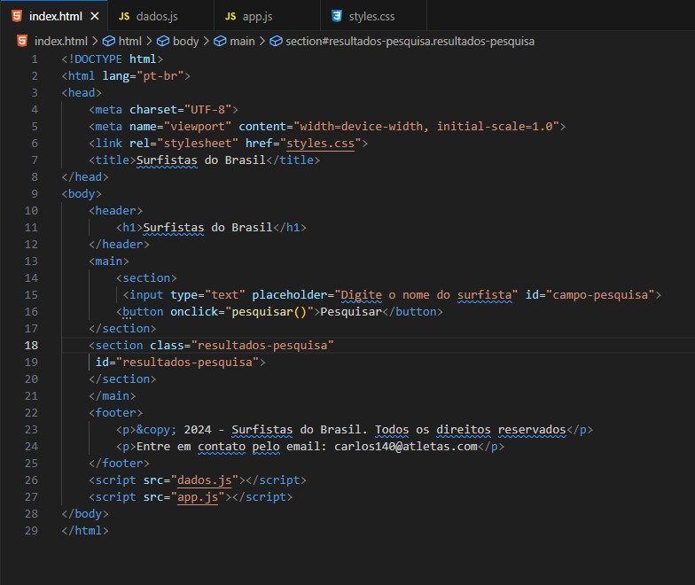
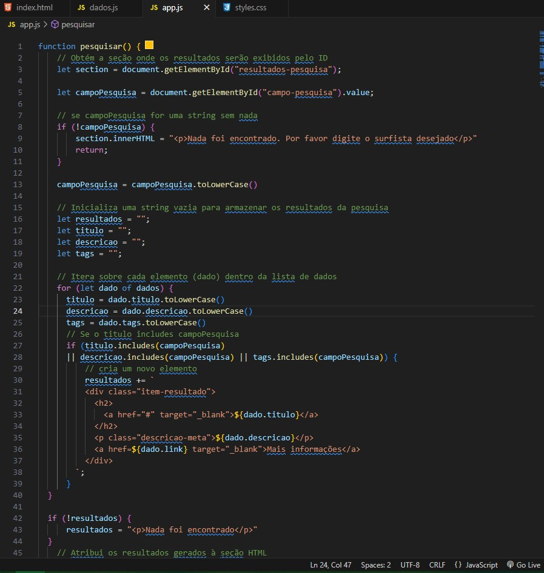

# Projeto Imersão DEV Google Gemini

# Sobre o projeto

Este projeto é uma construção do zero de um site de Surfistas do Brasil, este trabalho feito do zero, a partir do modelo do evento realizado pela Alura [Imersão Dev com Google Gemini]([https://cursos.alura.com.br/imersao]).

Este projeto consiste em sua estrutura principal das funcionalidades do site construido em HTML, seu Front-End utilizando a linguagem CSS e JavaScript, e consumindo os Dados e as funcionalidades de pesquisa do site e seu BackEnd em JavaScript com CSS. E toda a construção do projeto utilizamos a plataforma de Inteligencia Artificial o Google Gemini que traz muito conteúdo e práticas que podemos agregar e complementar na construção da codificação utilizada neste trabalho.

## Layout Site FrontEnd

## Layout Site Pesquisa Efetuada

## Estrutura e funcionalidades do site construido em HTML

## FrontEnd utilizando a linguagem CSS

## Consumo dos Dados utilizando JavaScript  

## Funcionalidades e estrutura de pesquisa utilizando JavaScript com HTML  

# Tecnologias utilizadas
## Back end
- HTML
- JavaScript

## Front end
- CSS / JavaScript 

# Autor

Carlos de Camargo Penteado Neto

[https://www.linkedin.com/in/carlos-de-camargo-penteado-neto-83974430]
